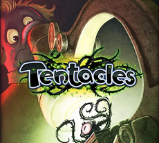
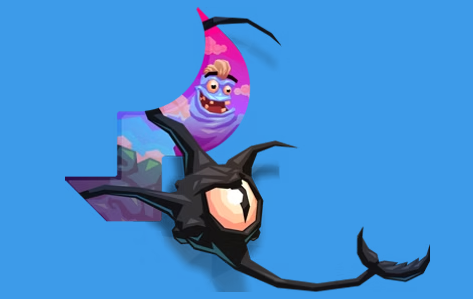

# Tentacles 1.1 -- main branch

R.E. of some early "xap-bird" (tentaclesV1-repacked?). Some "little remake" planned :) Src code contains some "Unity object".. idk it's real to port to UWP or not... :/  

## Preface 
- Log story in short: "Eat squishy eyeballs! This is the prequel to Tentacles - Enter the Mind."

## Game Scenario
Welcome to the mind of a mad professor for an all-you-can-eat eyeball buffet.​

Dr. Phluff’s obsession with everything cute has driven him mad, and only you can save him. Tap your way through the layers of the professor’s amazingly twisted mind. Set in a captivating 3D world, odd monsters hide behind every corner. Explore the many creepy layers of Dr. Phluff’s mind from his Paranoia to his Super-Ego and beyond. 

Dispatch enemies, collect squishy eyeballs and secret eggs, gain powers and abilities, and compete against your friends.

## Status 
- Reversed src code only (no bug fixes)

## Tech details
- UWP app (micro-game)
- Min. Win. SDK used: 10240 (Astoria compatibility)
- Monogame "engine" used
- Windsurf's ChatGPT 5 AI used for recover gamedev routines!

## Task List
- Explore mystic "UnityObject"
- Fix 100500 bugs :)

## TODO / Current Goal
- Fix accelerometer / gyroscope
- Polish and test final gameplay experience (add some coins, score, lives, wall breaks, etc... )

## Reference(s)
- https://4pda.to/forum/index.php?showtopic=254447 Tentacles : Enter the Dolphin (4PDA theme/ game posts, Rus.)

## ..
As is. No support. Just for fun! DIY.

## .
[m][e] 2025

